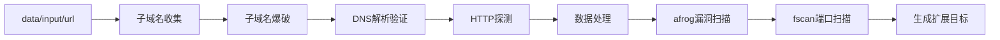
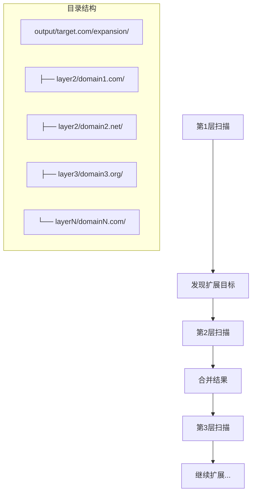

# 🎯 渗透测试自动化扫描平台

一个专业的域名资产发现与漏洞扫描自动化平台，支持无限层扫描和HTML报告生成。

## ✨ 核心特性

- **🔍 完整扫描流程**: 子域名发现 → HTTP探测 → 漏洞扫描
- **🔄 无限层扫描**: 支持多层递归扫描，自动发现新资产
- **📊 HTML可视化报告**: 美观的报告界面，URL可点击访问
- **🧪 测试模式**: 精简参数快速验证流程
- **🛡️ 漏洞检测**: 集成afrog和fscan工具
- **🎯 智能过滤**: 自动过滤CDN和噪音数据

## 🏗️ 项目结构

```
scan-platform/
├── scan.sh                    # 🚀 主扫描脚本 (支持多层扫描)
├── expand.sh                  # 🔄 扩展扫描脚本
├── generate_report.sh         # 📊 HTML报告生成脚本
├── install.sh                 # 📦 工具安装脚本
│
├── config/                    # ⚙️ 配置文件
│   ├── subdomains.txt         # 子域名字典
│   ├── resolvers.txt          # DNS解析器
│   ├── api/config.ini         # API配置
│   └── filters/               # 过滤规则
│
├── scripts/                   # 📝 核心脚本
│   ├── core/start.py          # 数据处理和漏洞扫描
│   ├── management/            # 扩展扫描管理
│   ├── report/                # HTML报告生成
│   │   ├── generate_scan_report.py          # 基础HTML报告
│   │   └── generate_interactive_report.py   # 多层交互式报告
│   └── utils/                 # 工具脚本
│
├── tools/scanner/             # 🔧 扫描工具
│   ├── subfinder, puredns, httpx, afrog, fscan
│
├── data/input/url             # 🎯 目标域名文件
├── output/                    # 📊 扫描结果
├── temp/                      # 🗂️ 临时文件
└── test_data.json             # 🧪 测试数据
```

## 🚀 快速开始

### 1. 安装工具

```bash
chmod +x install.sh
./install.sh
```

### 2. 配置目标

```bash
echo "target.com" > data/input/url
```

### 3. 开始扫描

```bash
# 测试模式（推荐首次使用）
./scan.sh --test

# 生产模式（完整扫描）
./scan.sh

# 多层扫描（自动执行2层）
./scan.sh -s 2

# 深度扫描（自动执行3层）
./scan.sh -s 3

# 无限扫描（直到无扩展目标）
./scan.sh -s x
```

### 4. 生成HTML报告

```bash
# 生成可视化报告
./generate_report.sh

# 生成并自动打开浏览器
./generate_report.sh --open
```

## 📊 完整执行流程

### 🎯 一层主扫描流程



**执行命令:**
```bash
# 测试模式（精简参数）
./scan.sh --test

# 生产模式（完整参数）
./scan.sh

# 指定扫描层数
./scan.sh -s 2  # 执行2层扫描
./scan.sh -s 3  # 执行3层扫描
./scan.sh -s x  # 无限扫描（直到无扩展目标）
```

**输出结果:** `output/target.com/`
```
target.com/
├── result_all.json            # httpx扫描原始数据
├── base_info_target.com.txt   # 基础信息汇总
├── input/
│   ├── representative_urls.txt # 去重后的代表性URL
│   ├── urls.txt               # 所有URL列表
│   └── a_records.txt          # A记录解析结果
├── afrog_report_*.json        # afrog漏洞扫描报告
├── fscan_*.txt               # fscan端口扫描报告
├── scan_report_*.html         # HTML可视化报告
└── tuozhan/all_tuozhan/       # 扩展目标（用于下层扫描）
    ├── ip.txt                 # 发现的IP地址
    ├── urls.txt               # 扩展URL目标
    └── root_domains.txt       # 新发现的根域名
```

### 🔄 多层扫描架构



**多层扫描流程:**
1. **第1层**: 基础域名扫描，生成扩展目标
2. **第2层**: 扫描第1层发现的独立域名（非子域名）
3. **第3层**: 扫描第2层发现的新独立域名
4. **第N层**: 递归扫描，直到无新发现

**扩展示例:**
- 第1层: target.com
- 第2层: target-2.com,target-3.com（独立域名）
- 第3层: target-4.com,target-5.com（独立域名）

### 🔄 手动扩展扫描

```bash
# 基于一层结果进行扩展
./expand.sh target.com run

# 测试模式扩展
./expand.sh target.com run --test

# 指定扫描层数
./expand.sh target.com run --layer 3
```

## 📊 HTML报告功能

### 🎨 报告特色

- **📱 响应式设计**: 支持桌面和移动设备
- **🌐 URL可点击**: 所有URL可直接点击访问
- **🔍 多层可视化**: 清晰显示各层扫描结果
- **🛡️ 漏洞突出**: 漏洞信息按严重程度颜色标识
- **📈 统计图表**: 扫描结果统计和流程图
- **🔗 域名关系图**: 可视化展示域名发现路径
- **📊 交互式导航**: 支持层级间快速切换

### 📋 报告内容

1. **扫描概览**: 总层数、发现的IP/URL/域名统计
2. **URL详情**: 地址、标题、状态码、页面大小
3. **端口扫描**: fscan完整输出，URL可点击
4. **漏洞信息**: afrog扫描结果，按严重程度分类
5. **层级关系**: 各层扫描发现的关系图

### 🚀 报告生成

```bash
# 自动检测域名并生成报告
./generate_report.sh

# 指定域名生成报告
./generate_report.sh target.com

# 生成后自动打开浏览器
./generate_report.sh target.com --open

# 指定输出路径
./generate_report.sh -o /path/to/report.html

# 生成交互式多层报告（推荐）
python3 scripts/report/generate_interactive_report.py target.com

# 生成基础HTML报告
python3 scripts/report/generate_scan_report.py target.com
```

## ⚙️ 参数配置

### 🎛️ 扫描层数控制

```bash
# 只执行第1层扫描
./scan.sh -s 1

# 执行1-2层扫描
./scan.sh -s 2

# 执行1-3层扫描  
./scan.sh -s 3

# 无限扫描（直到无扩展目标）
./scan.sh -s x

# 测试模式多层扫描
./scan.sh -s 3 --test

# 测试模式无限扫描
./scan.sh -s x --test
```

### 🧪 测试模式 vs 生产模式

| 模式 | 参数 | 子域名收集 | 爆破字典 | HTTP线程 | afrog规则 | fscan端口 | 适用场景 |
|------|------|------------|----------|----------|-----------|-----------|----------|
| 测试 | `--test` | -t 20 | 跳过 | 50 | -s spring | -p 80 | 快速验证 |
| 生产 | 默认 | -t 200 -all | 完整字典 | 300 | -S high,info | -p all | 深度扫描 |

### 🛡️ 漏洞扫描配置

**afrog配置** (scripts/core/start.py):
```python
# 测试模式
AFROG_CMD = "afrog -T {target} -c 100 -s spring -json {output}"

# 生产模式  
AFROG_CMD = "afrog -T {target} -c 100 -S high,info -json {output}"
```

**fscan配置**:
```python
# 测试模式
FSCAN_CMD = "fscan -hf {target} -p 80 -t 600 -o {output}"

# 生产模式
FSCAN_CMD = "fscan -hf {target} -p all -t 600 -o {output}"
```

## 🎯 使用场景

### 📊 场景1: 单目标深度挖掘

```bash
# 1. 设置目标
echo "target.com" > data/input/url

# 2. 执行无限扫描（推荐）
./scan.sh -s x

# 3. 生成HTML报告
./generate_report.sh target.com --open

# 4. 查看结果
ls -la output/target.com/
```

### ⚡ 场景2: 快速测试验证

```bash
# 1. 测试模式无限扫描
echo "target.com" > data/input/url
./scan.sh -s x --test

# 2. 生成简要报告
./generate_report.sh target.com

# 3. 清理测试数据
rm -rf output/target.com temp/result_all.json
```

### 🔄 场景3: 批量目标处理

```bash
# 批量处理多个目标
for target in target1.com target2.com target3.com; do
    echo "$target" > data/input/url
    ./scan.sh -s x --test
    ./generate_report.sh "$target"
done
```

### 🎨 场景4: 自定义扫描深度

```bash
# 根据发现情况调整扫描深度
echo "target.com" > data/input/url

# 先执行1层查看扩展目标
./scan.sh -s 1

# 根据扩展目标数量决定是否继续
if [ $(wc -l < output/target.com/tuozhan/all_tuozhan/root_domains.txt) -gt 5 ]; then
    ./scan.sh -s 3  # 发现较多目标，执行深度扫描
else
    ./scan.sh -s 2  # 发现较少目标，执行2层扫描
fi
```

## 🔧 高级功能

### 📈 扫描结果分析

```bash
# 查看扫描统计
cat output/target.com/base_info_target.com.txt

# 查看URL发现情况
wc -l output/target.com/input/urls.txt

# 查看漏洞发现
cat output/target.com/afrog_report_*.json | jq '.[] | .severity' | sort | uniq -c

# 查看端口开放情况
grep "open" output/target.com/fscan_*.txt
```

### 🎯 自定义过滤规则

编辑过滤配置文件：
```bash
# 编辑静态过滤规则
vim config/filters/filter-domain.txt

# 编辑动态过滤规则（程序运行时生成）
vim config/filters/filter_domains-动态.txt
```

### 🔄 手动层间扫描

```bash
# 手动执行特定层扫描
./expand.sh target.com run --layer 2
./expand.sh target.com run --layer 3

# 合并扫描结果
python3 scripts/management/merge_layer_results.py target.com --layer 2
```

## 🔍 故障排查

### 常见问题解决

1. **representative_urls.txt为空**
   ```bash
   # 检查黑名单过滤是否过严
   python3 scripts/core/start.py -test
   ```

2. **程序显示卡住**
   ```bash
   # 检查Python输出缓冲
   tail -f temp/log/scan_log_*.log
   ```

3. **扫描无结果**
   ```bash
   # 检查网络连接和DNS解析
   dig target.com
   curl -I https://target.com
   ```

4. **工具权限问题**
   ```bash
   # 检查工具权限
   chmod +x tools/scanner/*
   ```

### 🔧 调试模式

```bash
# 启用详细日志
DEBUG=true ./scan.sh --test

# 查看详细扫描过程
./scan.sh --test 2>&1 | tee scan_debug.log
```

## 🛡️ 安全说明

⚠️ **重要**: 本工具仅用于授权的渗透测试和安全研究

### 使用规范

1. **✅ 获得授权**: 只能对拥有或获得授权的目标进行扫描
2. **✅ 遵守法律**: 确保扫描活动符合当地法律法规
3. **✅ 负责使用**: 合理控制扫描频率，避免影响目标系统
4. **✅ 数据保护**: 妥善保护扫描结果，避免泄露敏感信息

### 防护措施

- 内置CDN检测和过滤机制
- 智能去重减少重复扫描
- 支持测试模式减少资源消耗
- 自动清理临时文件

## 📝 更新日志

### v3.1 (2025-07-17) - 交互式报告 + 架构优化

- 🎨 **交互式报告**: 新增多层交互式HTML报告，支持层级导航
- 🔗 **域名关系图**: 可视化展示域名发现路径和关系
- 🏗️ **架构优化**: 第三层扩展改为独立域名（非子域名）
- 🐛 **Bug修复**: 修复report生成时的fscan数据结构问题
- 📄 **文档更新**: 完善README，添加多层扫描示例

### v3.0 (2025-07-16) - 无限层扫描 + HTML报告

- 🎉 **无限层扫描**: 支持任意层数的递归扫描
- 📊 **HTML可视化报告**: 美观的报告界面，URL可点击
- 🔄 **自动层间处理**: 每层结果自动合并，供下层使用
- 🎯 **统一扫描入口**: scan.sh支持-s参数控制扫描层数
- 📈 **扫描统计**: 完整的扫描结果统计和可视化
- 🛠️ **代码重构**: 优化代码结构，提高可维护性
- 🧪 **测试数据**: 完善的测试数据和验证流程

### v2.1 (2025-07-15) - 流程简化 + 路径优化

- ✅ **简化核心流程**: 回到基础的一层→二层扫描流程
- ✅ **精简脚本**: 移除复杂的管理功能，专注核心扫描
- ✅ **优化test参数**: 精确控制字典大小和线程数
- ✅ **自动临时文件清理**: 扫描完成后自动清理temp目录

### v2.0 - 架构优化

- 🔄 多层扫描架构
- 🧹 智能管理系统
- 📊 简化输出结构

### v1.x - 基础功能

- 🔍 子域名发现和HTTP探测
- 🛡️ 漏洞扫描集成

---

## 🎯 核心优势

| 特性 | 描述 | 优势 |
|------|------|------|
| 🔄 **无限层扫描** | 支持任意层数递归扫描 | 发现隐藏资产 |
| 📊 **HTML报告** | 美观的可视化报告 | 便于分析和展示 |
| 🧪 **测试模式** | 精简参数快速验证 | 提高开发效率 |
| 🎯 **智能过滤** | 自动过滤噪音数据 | 聚焦有价值目标 |
| 🛡️ **安全扫描** | 集成专业漏洞扫描工具 | 全面安全检测 |

---

🎯 **无限层扫描** | 📊 **HTML可视化** | 🛡️ **专业安全检测** | 🧪 **敏捷开发友好**